# Design & Development Documentation for Problem 1 - Task List App

- [Design \& Development Documentation for Problem 1 - Task List App](#design--development-documentation-for-problem-1---task-list-app)
  - [P3 Definition Statement](#p3-definition-statement)
  - [P3 Data Dictionary](#p3-data-dictionary)
  - [P3 Algorithm Designs](#p3-algorithm-designs)
    - [Pseudocode](#pseudocode)
    - [Flowcharts](#flowcharts)
  - [P3 GUI Design](#p3-gui-design)
  - [P3 Test Plan](#p3-test-plan)
  - [M2 Design Justifications](#m2-design-justifications)
  - [P5 Produce programs that meet designs](#p5-produce-programs-that-meet-designs)
  - [P6 Testing](#p6-testing)
  - [P4 Reviewing my design with others to inform improvements](#p4-reviewing-my-design-with-others-to-inform-improvements)
  - [M3 Optimisation](#m3-optimisation)
  - [P7 Review the extent to which the program meets client requirements](#p7-review-the-extent-to-which-the-program-meets-client-requirements)

## P3 Definition Statement

This program will be a simple application designed to demonstrate Graphical User Interface (GUI) development concepts in C#. The application will allow users to create and delete tasks, mark tasks as complete or incomplete, edit task details, and display tasks based on their completion status. Its primary purpose is to demonstrate object-oriented programming concepts and GUI design. It is moderately complex, with key components including state tracking, data mutability, and display filtering.

Constraints:

- The application must be developed using C#.
- The application should focus on core functionalities and avoid advanced features.
- Data persistence (saving and loading tasks) is not required.

Intended Users:

- General users looking for a basic to-do list tool.

Interactivity:

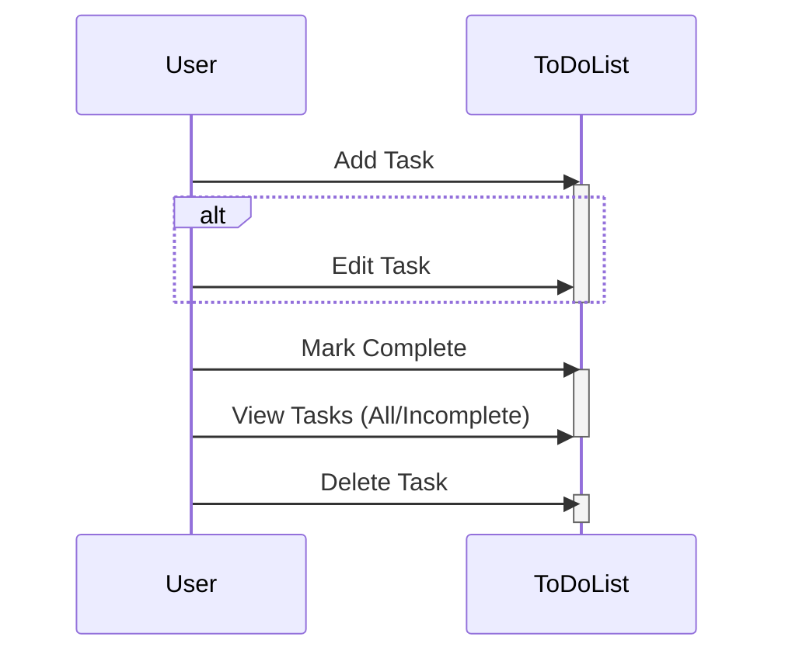

**Client requirements:**

- Creation and deletion of tasks,
- Allowing tasks to be set to complete,
- Tracking done state,
- Supporting title, description, and due date,
- Mutable description and due date,
- Displaying a list of tasks,
- Toggling whether all tasks or only incomplete tasks are displayed.
  
## P3 Data Dictionary

1. ### Data Structures

    **Models**

    **Class `Task`**\
    Represents a task.\
    *Attributes:*
    - `Title` (string): Title of task.
    - `Description` (string): Description of task.
    - `StartDate` (DateTime): Start date of task.
    - `EndDate` (DateTime): End date of task.
    - `Status` (bool): Indicates whether task is completed (true) or incomplete (false)
    - `ToDelete` (bool): Indicates whether the task is marked for deletion (true) or not (false)\
    *Methods:*
    - `ToString()`: Overrides the default ToString() method to provide a formatted string representation of the task

    **Class `TaskManager`**\
    Manages a collection of tasks, including the retrieval, adding and deletion of them.\
    *Attributes:*
    - `ListTasks` (ObservableCollection): Collection of tasks managed by the TaskManager.\
    *Methods:*
    - `GetTasks()`: Returns the collection of tasks
    - `AddTask(Task task)`: Adds a new task to the collection
    - `DeleteTask(Task task)`: Deletes a task from the collection

    **View Models**

    **Class `CreateTaskViewModel`**\
    Handles the creation of new tasks including command bindings for adding them.\
    *Attributes*:
    - `AddTaskCommand` (ICommand): Command to add a new task.
    - `Title` (string)
    - `Description` (string)
    - `StartDate` (string)
    - `EndDate` (string)
    - `Status` (bool)
    - `ToDelete` (bool)\
    *Methods:*
    - `AddTask()`: Adds a new task to the collection.

    **Class `MainViewModel`**\
    Manages the task listing view of the application, including commands for showing the task creation window, deleting tasks, and filtering tasks.\
    *Attributes:*
    - `Tasks` (ObservableCollection): Collection of tasks managed by the main viewmodel.
    - `ShowWindowCommand` (ICommand)
    - `DumpTasksCommand` (ICommand)
    - `DeleteTaskCommand` (ICommand)
    *Methods:*
    - `DeleteTask`
    - `DumpTasks`
    - `ShowWindow`

    **Views - Code Behind**

    **Class `MainWindow`**\
    Handles the main window logic including event handlers for toggling visibility of tasks.

2. ### Control Structures

    **Loops**
    - Foreach loop used in the MainViewModel's DeleteTask() to iterate over tasks stored in the collection.
    - Foreach loop used in the MainViewModel's DumpTasks() to iterate over tasks to be printed.

    **Conditionals**
    - If statement in MainViewModel to check which tasks have ToDelete = true and call the TaskManager model's DeleteTask method accordingly.

3. ### Event Handlers

   `CompleteToggle_Checked`: Handles the "completed" checkbox checked event.
   `CompleteToggle_Unchecked`: Handles the "completed" checkbox unchecked event.

## P3 Algorithm Designs

### Pseudocode

```code
Class Task:
    Attributes:
        Title: string
        Description: string
        StartDate: DateTime
        EndDate: DateTime
        Status: bool
        ToDelete: bool

    Methods:
        ToString():
            Return formatted string representation of task.
```

```code
Class TaskManager:
    Static Attributes:
        ListTasks: ObservableCollection<Task>

    Methods:
        GetTasks():
            Return ListTasks.
        
        AddTask(task):
            Add task to ListTasks.
        
        DeleteTask(task):
            Remove task from ListTasks.
```

```code
Class CreateTaskViewModel:
    Attributes:
        AddTaskCommand: ICommand
        CancelTaskCommand: ICommand
        Title: string
        Description: string
        StartDate: DateTime
        EndDate: DateTime
        Status: bool
        ToDelete: bool

    Constructor:
        Initialize AddTaskCommand with RelayCommand(AddTask).

    Methods:
        AddTask(obj):
            Create new Task object with provided data and add it using TaskManager.
```

```code
Class MainViewModel:
    Attributes:
        Tasks: ObservableCollection<Task>
        ShowWindowCommand: ICommand
        DumpTasksCommand: ICommand
        DeleteTaskCommand: ICommand

    Constructor:
        Initialize Tasks with TaskManager.GetTasks().
        Initialize ShowWindowCommand with RelayCommand(ShowWindow, CanShowWindow).
        Initialize DumpTasksCommand with RelayCommand(DumpTasks, CanDumpTasks).
        Initialize DeleteTaskCommand with RelayCommand(DeleteTask, CanDeleteTask).

    Methods:
        CanDeleteTask(obj):
            Return true.

        DeleteTask(obj):
            Iterate over Tasks and delete tasks marked for deletion using TaskManager.

        CanDumpTasks(obj):
            Return true.

        DumpTasks(obj):
            Output string representation of each task in Tasks to debug console.

        CanShowWindow(obj):
            Return true.

        ShowWindow(obj):
            Create and show CreateTaskView window.

```

```code
Class CreateTaskView:
    Constructor:
        Initialize DataContext with CreateTaskViewModel object.
```

```code
Class MainWindow:
    Event Handlers:
        CompleteToggle_Checked(sender, e):
            Clear FilterTextBox and filter TaskListView items to show incomplete tasks.

        CompleteToggle_Unchecked(sender, e):
            Clear TaskListView filter.
```

### Flowcharts

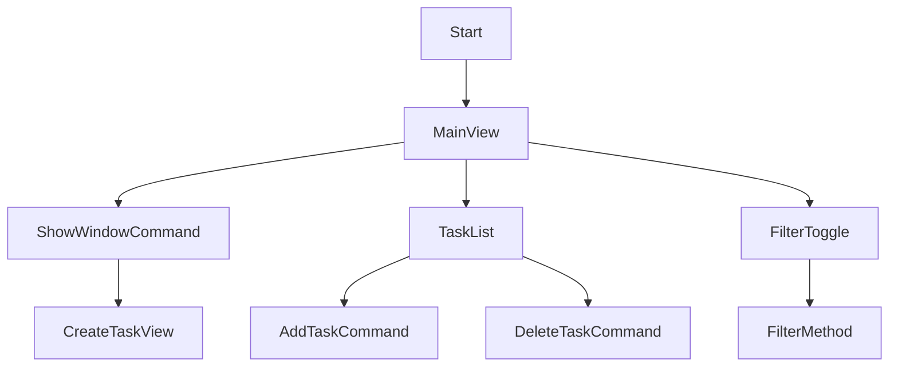

## P3 GUI Design

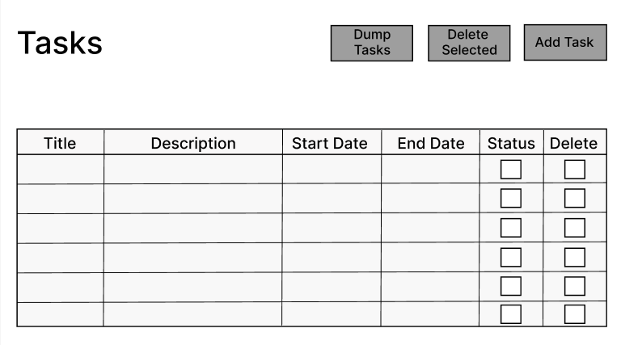
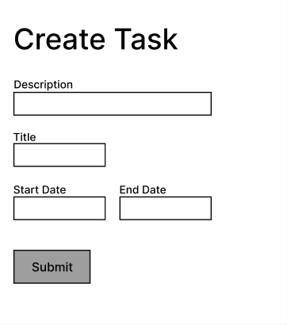

## P3 Test Plan

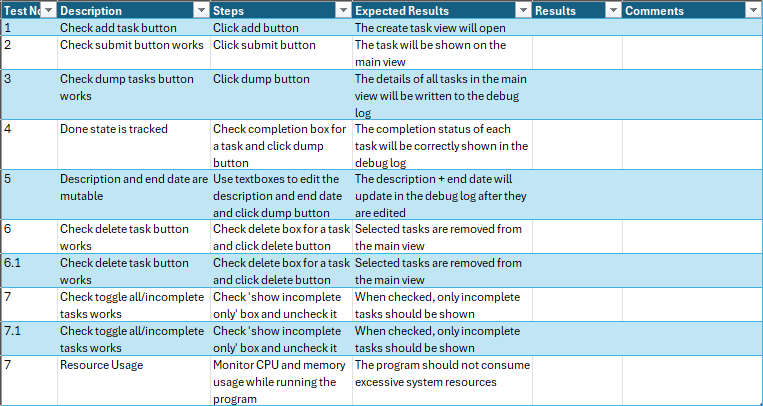

## M2 Design Justifications

The GUI is simplistic but clear and aesthetically pleasing, containing large buttons to direct the user. and a clear layout for the task list. It meets client requirements of adding, deleting and filtering tasks. One shortcoming is that it does not show how tasks will be edited; when a task is created, the user will be able to edit the description and due date in the task list.

I used the MVVM pattern to separate the application logic and the user interface. The model, the view and the view model each serve a different purpose. [Reference](https://learn.microsoft.com/en-us/dotnet/architecture/maui/mvvm) This helps to reduce the risk of several maintenance issues that are typical of creating a user interface then adding code-behind that operates on it. It allows for independent development, testing and refinement of each component, making the application more robust and maintainable.

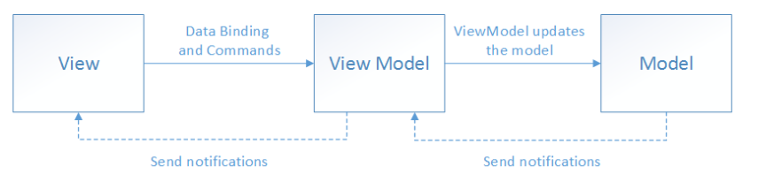

The design of the ToDo application follows object-oriented principles. Encapsulation is shown in how task details and operations are grouped within the 'Task' and 'TaskManager' classes, displaying modularity. The use of inheritance and interfaces such as the 'RelayCommand' class implementing 'ICommand' ensures that command logic is decoupled from the UI, facilitating better code organisation and reuse.

The clear and aesthetically pleasing GUI combined with the MVVM architecture provides a user-friendly experience while ensuring that the application is robust and easy to maintain. This approach meets the client's requirements effectively by providing a well-structured, flexible, and scalable sollution.

## P5 Produce programs that meet designs

Navigation to the code can be found in the repo's ReadMe file.

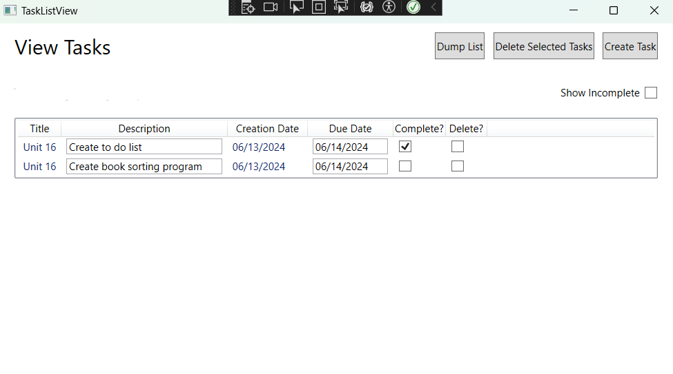
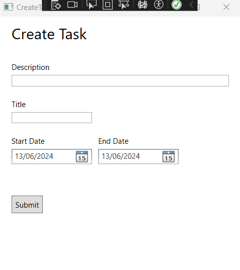
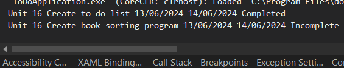

## P6 Testing

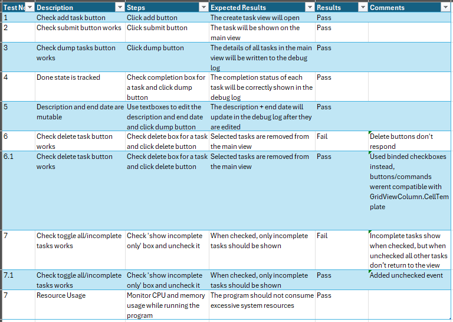

## P4 Reviewing my design with others to inform improvements


One of the reviews of the suggested adding more features to the design so that the application could go beyond just meeting the client requirements. One way to do this would be to add a text box that allows the user to filter tasks by title, adding more functionality to the app. I updated my Figma design to incorporate this, adding a textbox above the task list.

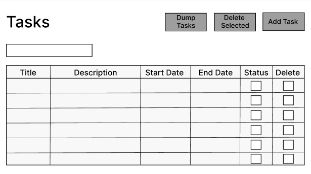


The compiler issues warnings when code has constructs that may lead to null reference exceptions. These warnings are issued because the properties in the Task class.

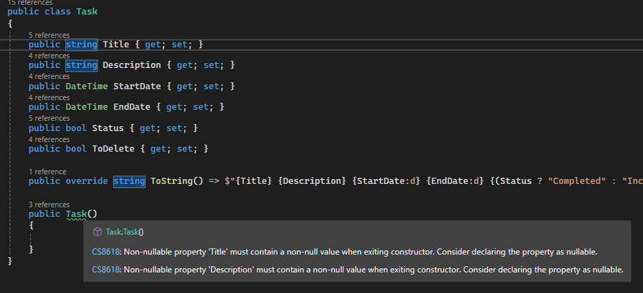


One of the reviews I received was that the code for both tasks lacked comments, impacting its readability. To optimise the code, I will add comments to describe its intent and functionality. This will help myself and others to understand the code more easily in the future and will make it easier to maintain and modify the code, making it more efficient.

## M3 Optimisation

To incorporate the review to add more features into the app, I added a small text box to the main view of the WPF app and created some event handlers to filter the list of tasks based on their title matching the text in the box.

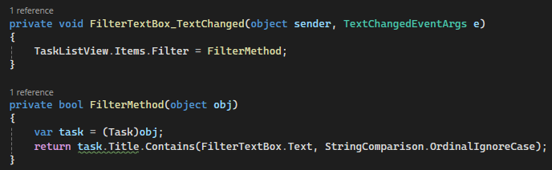
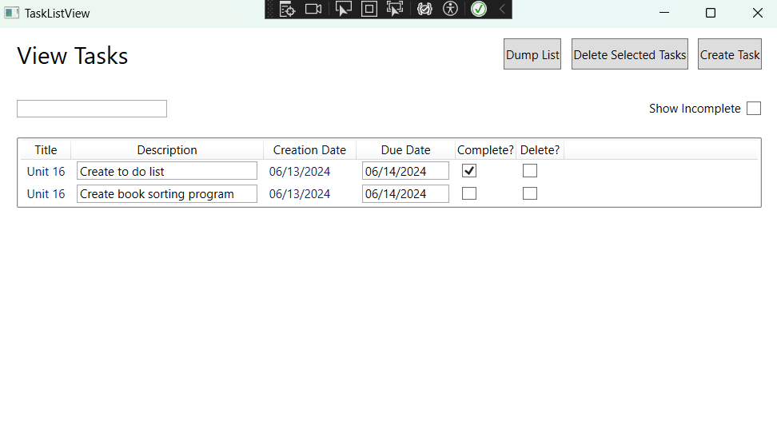
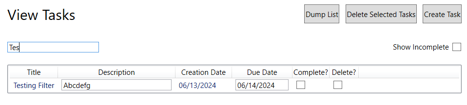

To remove the warnings also mentioned in the reviews, I addressed them by adding nullable annotations `?`.

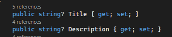
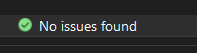

Optimised code with added comments and the filter text box can be found in the ToDoApp folder in the repository.

## P7 Review the extent to which the program meets client requirements

The ToDo application is well-rounded and successfully meets all of the client requirements. Firstly, it supports the creation and deletion of tasks through the `TaskManager` class, which provides methods for adding and removing tasks from an observable collection.

The application allows tasks to be set to complete, effectively tracking their done state. This is managed through the `Status` property in the `Task` class, which can be toggled to reflect whether a task is completed or not. The `MainWindow` class further enhances this by providing a filtering mechanism to display only incomplete tasks, satisfying the client requirement for toggling between all tasks and only incomplete ones.

The application has the essential task attributes such as title, description, and due date (presented as a start and end date), with the `Task` class encapsulating these properties. The UI allows for these fields to be mutable, providing users with the ability to edit task descriptions and change the date they are due.

The application's ability to display a list of tasks is handled by the `MainViewModel` class, which binds the task collection to the UI, ensuring that any changes to the task list are immediately reflected in the user interface.

Overall, the ToDo application meets all of the client requirements listed.
