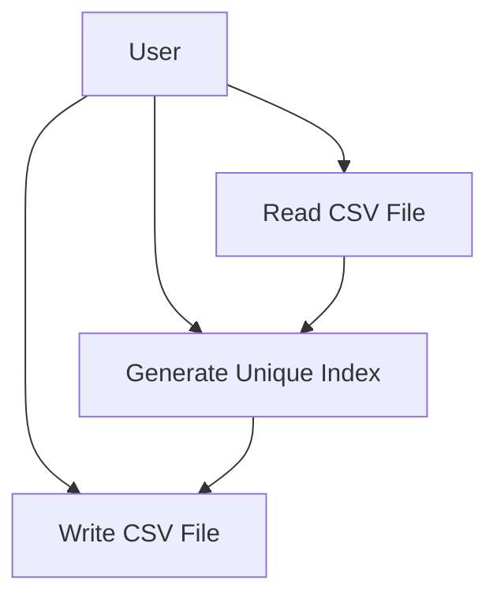
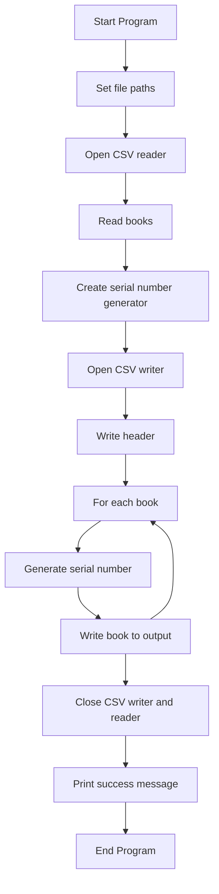
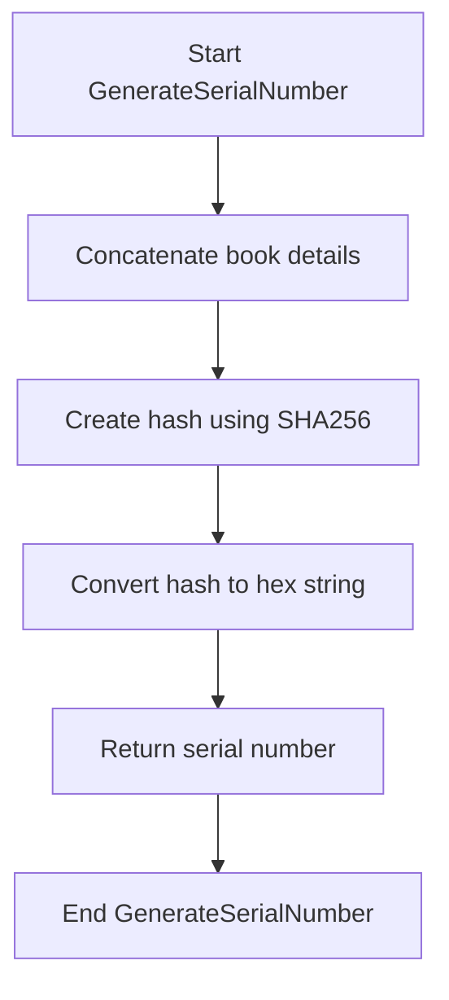
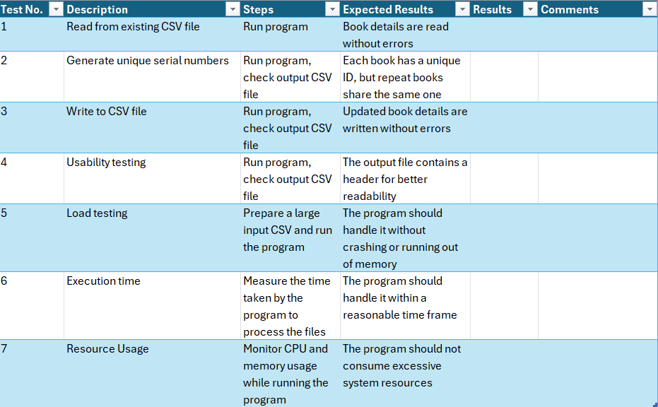
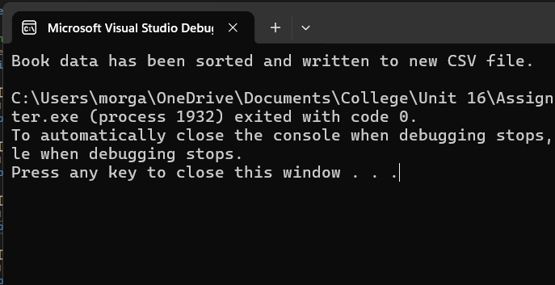
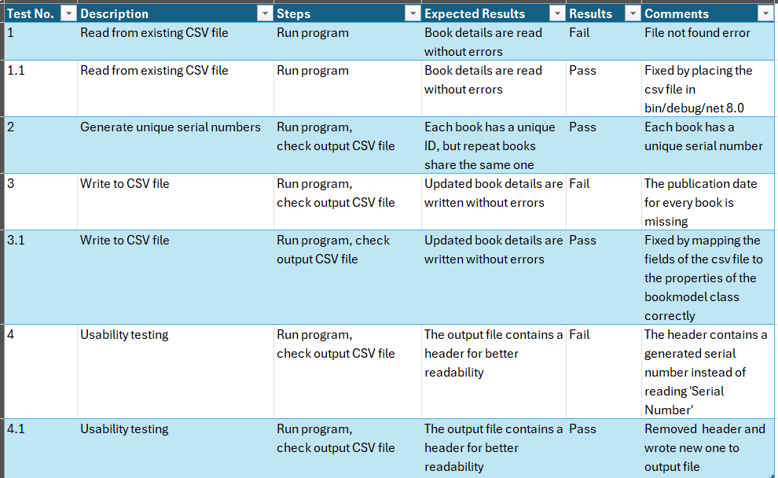
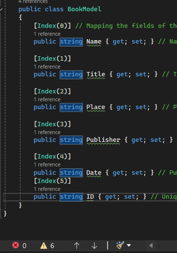
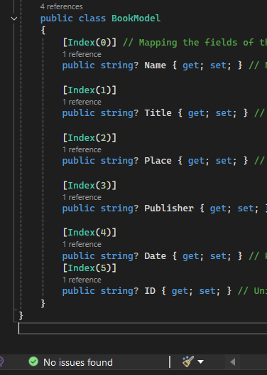

# Design & Development Documentation for Problem 2 - Library Index Program

- [Design \& Development Documentation for Problem 2 - Library Index Program](#design--development-documentation-for-problem-2---library-index-program)
  - [P3 Definition Statement](#p3-definition-statement)
  - [P3 Data Dictionary](#p3-data-dictionary)
  - [P3 Algorithm Designs](#p3-algorithm-designs)
    - [Flowcharts](#flowcharts)
    - [Pseudocode](#pseudocode)
  - [P3 Test Plan](#p3-test-plan)
  - [M2 Design Justification](#m2-design-justification)
  - [P5 Produce programs that meet designs](#p5-produce-programs-that-meet-designs)
  - [P6 Testing](#p6-testing)
  - [P4 Reviewing my design with others to inform improvements](#p4-reviewing-my-design-with-others-to-inform-improvements)
  - [M3 Optimisation](#m3-optimisation)
  - [P7 Review the extent to which the program meets client requirements](#p7-review-the-extent-to-which-the-program-meets-client-requirements)

## P3 Definition Statement

This program will be a system for a college library that reads book details from a CSV file, generates unique index references for each book, and writes the updated details to a new CSV file. This problem is less complex, and will demonstrate data handling, file processing, and the use of interfaces in C#.

Constraints:

- The program must be developed using C#.
- It should handle CSV files without headers.
- The generated index references must be unique.
- The application should be extendable to allow different indexing mechanisms through the use of interfaces.

Intended Users:

- Library staff who need to index books efficiently.

Interactivity:



**Client requirements:**

- Automatically read book details from a CSV file,
- Generate a unique index reference,
- Write to a new CSV file,
- Separate class responsible for serial number allocation through an interface.

## P3 Data Dictionary

1. ### Data Structures
  
    **Class `BookModel`**\
    Attributes:
   - `Name` (string): The name of the author.
   - `Title` (string): The title of the book.
   - `Place` (string): The place of publication.
   - `Publisher` (string): The publisher of the book.
   - `Date` (string): The publication date of the book.
   - `ID` (string): The unique identifier for the book.

    **Class `SerialNumberGenerator`**
   - Implements the `ISerialNumberGenerator` interface.
   - Generates a unique serial number for a book based on its details.

    **Interface `ISerialNumberGenerator`**
    - Defines the method `GenerateSerialNumber` for generating serial numbers.

2. ### Control Structures

    **Loops**
    - For loop used in `SerialNumberGenerator.GenerateSerialNumber`
    - Foreach loop used to iterate over list of books and generate serial numbers

    **Try-Catch Blocks**
    - Used to handle exceptions related to file access/CSV operations.

3. ### Data Storage

   **CSV Files**
   - `existingCsvPath`: The input CSV file containing book details.
   - `newCsvPath`: The output CSV file where updated book details with IDs are stored.

4. ### Pre-defined Code

    **Libraries**
    - `CsvHelper`: An external library for reading and writing CSV files.
    - `System.Security.Cryptography`: A system library providing cryptographic services.
    - `System.IO`: A system library providign types for reading and writing to files and data streams.

## P3 Algorithm Designs

### Flowcharts





### Pseudocode

Generate Serial Number

```code
BEGIN GenerateSerialNumber(book)
    Create variable 'serialNumber' = Guid.NewGuid()
    serialNumber to string
    RETURN serialNumber
END GenerateSerialNumber
```

Main Program

```code
BEGIN Program
    SET existingCsvPath TO "CSVFiles\U16A2Task2Data.csv"
    SET newCsvPath TO "CSVFiles\New_TaskData.csv"
    
    TRY
        SET config TO new CsvConfiguration(CultureInfo.InvariantCulture)
        SET config.HeaderValidated TO null
        SET config.MissingFieldFound TO null
        
        OPEN reader FROM existingCsvPath
        SET csvIn TO new CsvReader(reader, config)
        
        READ books FROM csvIn
        
        SET serialNumberGenerator TO new SerialNumberGenerator()
        
        OPEN writer TO newCsvPath
        SET csvOut TO new CsvWriter(writer, CultureInfo.InvariantCulture)
        
        WRITE header TO csvOut
        NEXT record
        
        FOR EACH book IN books
            SET book.ID TO serialNumberGenerator.GenerateSerialNumber(book)
            WRITE book TO csvOut
            NEXT record
        END FOR
        
        CLOSE csvOut
        CLOSE writer
        
        CLOSE csvIn
        CLOSE reader
        
        PRINT "Book data has been sorted and written to new CSV file."
    CATCH FileNotFoundException
        PRINT "Could not find file."
    CATCH CsvHelperException
        PRINT "Error occurred in CsvHelper."
    CATCH Exception
        PRINT "Error occurred."
    END TRY
END Program
```

## P3 Test Plan



## M2 Design Justification

I used the external library CsvHelper to simplify the code and improve the performance of the program. It boasts low memory usage; when reading a CSV file, only a single record is returned at a time as the records are iterated- only a small portion of the file will be read into memory.\
One of the features of CsvHelper is attribute mapping, where you can specify which position the CSV field is that you want to use for a property. This solves the issue of unreliable ordering of class members in .NET. [Reference](https://joshclose.github.io/CsvHelper/) To automatically read book details from a CSV file, the CsvHelper external library was chosen for its robust functionality in handling CSV operations. This design and coding decision simplifies the process of reading and parsing CSV files, reducing the likelihood of errors and increasing the readability of the code. It is a reliable library, ensuring the implementation is efficient and accurate compared to manual parsing.
Compared to other viable solutions, the decisions made in this implementation have made the program much simpler and more efficient. Manual CSV parsing would increase complexity and the potential for errors, whereas CsvHelper offers a more streamlined approach. Including the serial number generation directly in the main program logic would also make it difficult to create different implementations of serial numbers.

I also designed a separate class responsible for allocating serial numbers through the implementation of an interface so that alternative implementations of a serial number generator could be created later, making the program easily expanded upon. The decision to use a separate class that implements the ISerialNumberGenerator interface was crucial. Using SHA256 ensures collision resistance, making it highly unlikely for two books to have the same serial number. This approach is more secure and reliable compared to simpler hashing methods, increasing the uniqueness of each serial number.

## P5 Produce programs that meet designs

Navigation to the code can be found in the repo's ReadMe file.



## P6 Testing



## P4 Reviewing my design with others to inform improvements


The compiler issues warnings when code has constructs that may lead to null reference exceptions. These warnings are issued because the properties in the BookModel class.




One of the reviews I received was that the code for both tasks lacked comments, impacting its readability. To optimise the code, I will add comments to describe its intent and functionality. This will help myself and others to understand the code more easily in the future and will make it easier to maintain and modify the code, making it more efficient.


I also asked Chat GPT to review my code and generate a suggestion in two sentences. For problem 2, it suggested that I should choose another method to generate serial numbers for the book. To generate serial numbers in the optimised code, I will use the SHA256 hashing algorithm; this is because it solves the problem of hashing collisions well. Two separate inputs cannot produce an identical hash, reducing the risk of two different books sharing the same serial number as the library system grows. However, the hash produced will be quite long, with a 256-bit output. It could be truncated, but this would reduce the collision resistance. [Reference](https://nordvpn.com/blog/sha-256/#:~:text=SHA%2D256%20refers%20to%20the,input%20from%20the%20hash%20value.)

Pseudocode to design this optimisation:

```code
BEGIN GenerateSerialNumber(book)
    SET toconvert TO CONCATENATE(book.Name, book.Title, book.Place, book.Publisher, book.Date)

    CREATE hashAlgorithm USING SHA256.Create()
    SET data TO hashAlgorithm.ComputeHash(UTF8.GetBytes(toconvert))
    
    SET sBuilder TO new StringBuilder()
    
    FOR EACH byte IN data
        APPEND byte.ToString("x2") TO sBuilder
    END FOR
    
    SET serialNumber TO sBuilder.ToString()
    
    RETURN serialNumber
END GenerateSerialNumber
```

## M3 Optimisation

I cleared the warnings for problem 2's code.



The optimised code for the serial number generator is very closely based on the example given for calculating a SHA256 hash in the class' [Microsoft Documentation.](https://learn.microsoft.com/en-us/dotnet/api/system.security.cryptography.sha256?view=net-8.0)

The code also now has comments to improve readability. The code can be found in the BookIndexSystem folder in the repository. Below is a snippet of the optimised code for the serial number generator.

```code
using System.Security.Cryptography;
using System.Text;

namespace BookSorter
{
    // Interface for generating serial numbers
    public interface ISerialNumberGenerator
    {
        string GenerateSerialNumber(BookModel book);
    }

    // Implementation of the serial number generator using SHA256
    public class SerialNumberGenerator : ISerialNumberGenerator
    {
        public string GenerateSerialNumber(BookModel book)
        {
            // Concatenate book details into a single string
            String toconvert = $"{book.Name}{book.Title}{book.Place}{book.Publisher}{book.Date}";
            using (var hashAlgorithm = SHA256.Create())
            {
                // Compute the hash of the concatenated string
                byte[] data = hashAlgorithm.ComputeHash(Encoding.UTF8.GetBytes(toconvert));
                var sBuilder = new StringBuilder();
                // Convert the byte array to a hexadecimal string
                for (int i = 0; i < data.Length; i++)
                {
                    sBuilder.Append(data[i].ToString("x2"));
                }
                var serialNumber = sBuilder.ToString();
                // Return the hexadecimal string as the serial number
                return serialNumber;

                //based on microsoft documentation https://learn.microsoft.com/en-us/dotnet/api/system.security.cryptography.hashalgorithm.computehash?view=netcore-3.1#System_Security_Cryptography_HashAlgorithm_ComputeHash_System_Byte___
            }
        }
    }
}
```

## P7 Review the extent to which the program meets client requirements

The code for the library indexing system has been designed and implemented to comprehensively meet the client requirements. First and foremost, it automatically reads book details from a CSV file, leveraging the CsvHelper library to parse the data accurately and efficiently. It also generates a unique index reference using a SHA256 algorithm to minimise risk of collisions and making sure each book can be uniquely identified, accessed through an interface adhering to the principles of OOP by promoting modularity and reusability. It writes to a new CSV file, and has a separate class responsible for serial number allocation through an interface, meeting all client requirements. Futhermore, it includes comprehensive error handling to manage potential issues such as missing files or CSV parsing errors. This robust error handling ensures that the system can handle unexpected scenarios, providing meaninful feedback to the user.

Overall, this program fully meets the client requirements.
